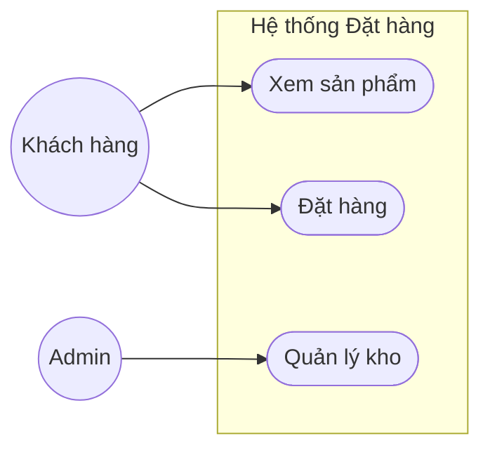
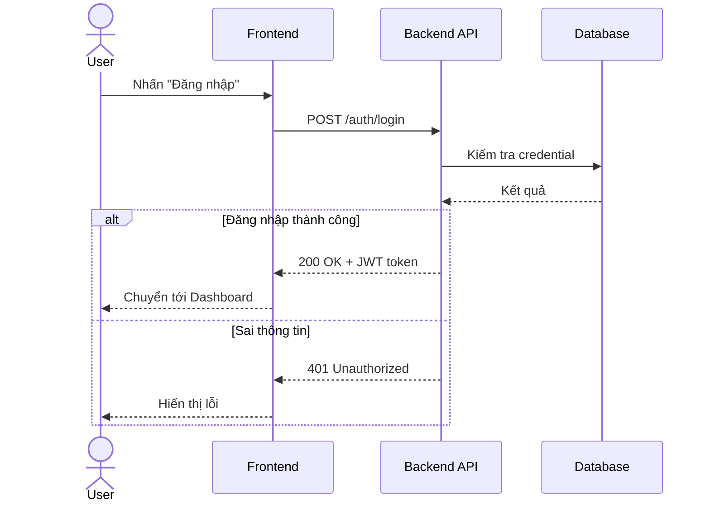
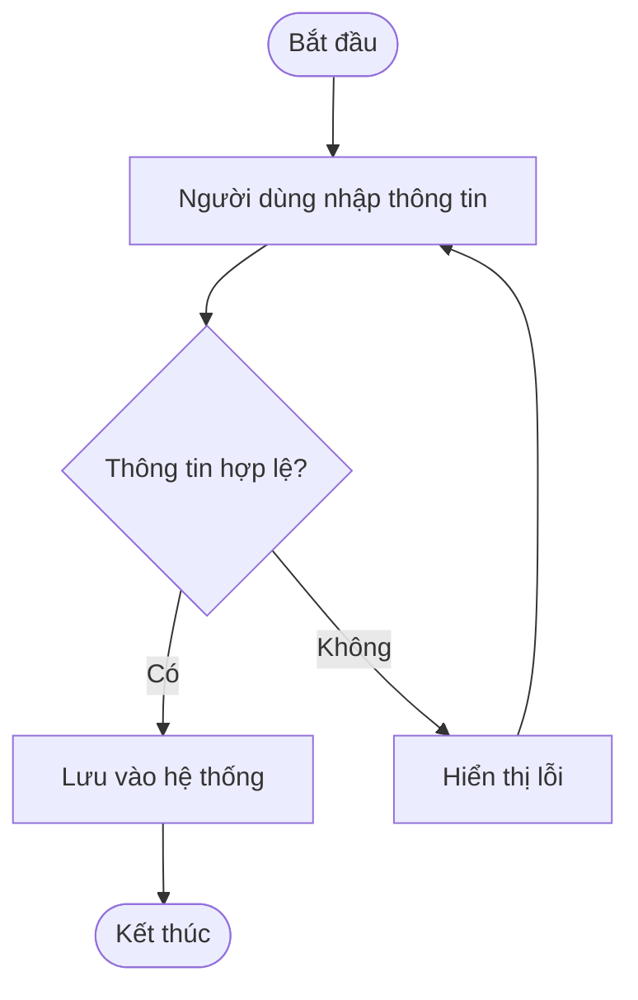
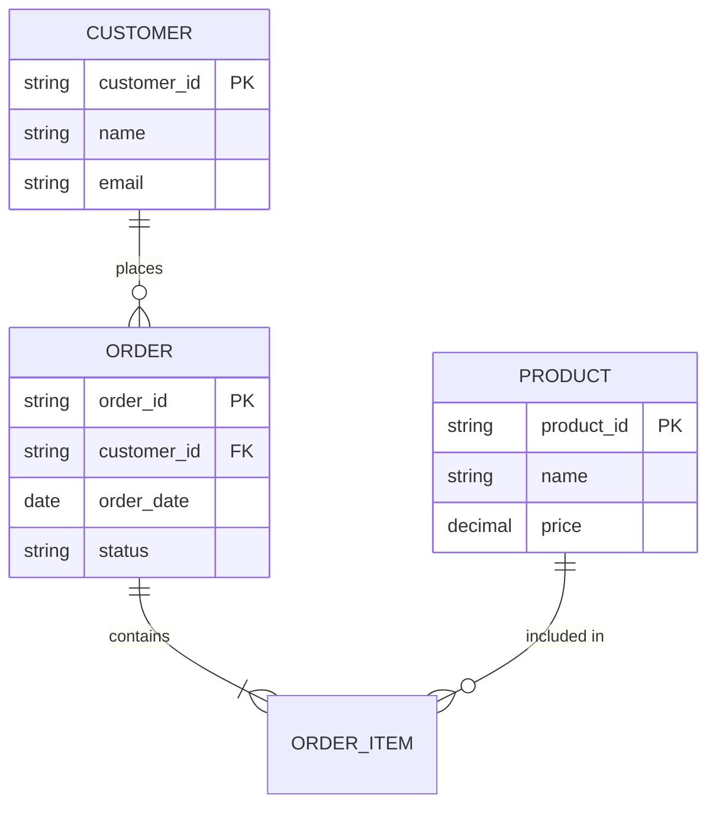
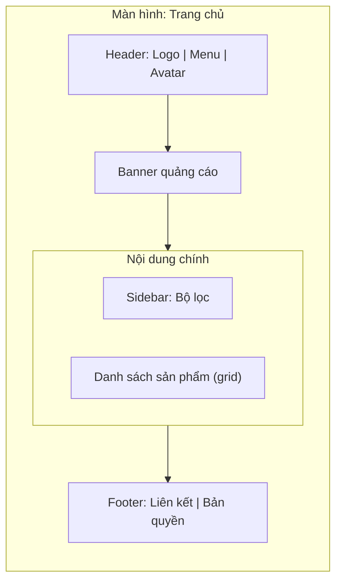

# Mermaid Diagram Snippets cho SA Documentation

Dùng đúng loại diagram cho đúng mục đích. Đặt code block ```mermaid``` trong file .md, hầu hết renderer (GitHub, GitLab, VSCode preview...) hiển thị trực tiếp.

## 1. Use Case Diagram

Mermaid không có use case notation chuẩn UML, mô phỏng bằng `flowchart` với actor là node hình người (dùng subgraph để nhóm use case trong hệ thống):



## 2. Sequence Diagram



## 3. Activity Diagram (dùng flowchart)



## 4. ERD (Entity Relationship Diagram)



## 5. Wireframe (mô phỏng bằng block layout)

Mermaid không có wireframe engine thật — dùng `flowchart` với các box vuông đại diện vùng layout, ghi rõ đây là low-fidelity mockup, không phải UI thật. Nếu người dùng cần độ chi tiết cao hơn (màu sắc, spacing thật), đề xuất chuyển sang visualizer/HTML mockup thay vì Mermaid.



## Nguyên tắc chọn diagram
| Mục đích | Diagram |
|---|---|
| Ai làm gì với hệ thống | Use Case |
| Luồng tương tác giữa các component theo thời gian | Sequence |
| Luồng xử lý nghiệp vụ / quyết định | Activity (hoặc BPMN-style flowchart) |
| Cấu trúc dữ liệu / quan hệ bảng | ERD |
| Bố cục màn hình mức thô | Block-layout flowchart (không thay thế được Figma) |