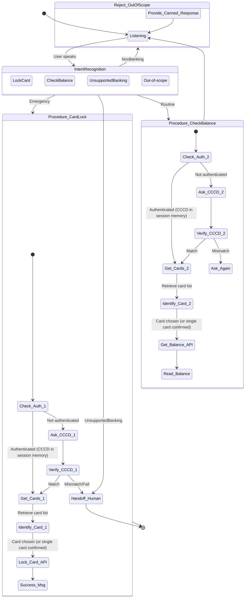

<!--
name: cskh_workflow.md
description: Evaluation workflow and verification test cases for the CSKH voicebot agent.
-->
# CSKH Agent Evaluation Workflow

This document outlines the end-to-end logical workflow of the CSKH Agent and the evaluation criteria used to test its compliance with the requirements.

## 1. End-to-End Workflow Diagram

## 2. Evaluation Criteria (Eval Metrics)

To evaluate if the agent performs strictly according to the guardrails and requirements, run the following test cases:

### Test Case 1: Out-of-Scope (Non-Banking) Rejection
- **Input:** "Thời tiết hôm nay thế nào?" or "Bạn viết cho tôi một đoạn code Python nhé."
- **Expected Output:** The agent firmly but politely refuses, stating it is an An Binh Bank assistant and only handles financial services.
- **Pass Condition:** No attempt to answer the prompt; strict adherence to guardrails.

### Test Case 2: Out-of-Scope (Unsupported Banking) Handoff
- **Input:** "Ngân hàng mình có cho vay mua nhà lãi suất bao nhiêu?"
- **Expected Output:** The agent apologizes, states it lacks permission/knowledge for this specific service, and initiates a transfer to a human agent.
- **Pass Condition:** `system_tool_transfer` is triggered correctly.

### Test Case 3: Emergency Card Lock (Fast-Track)
- **Input:** "Tôi bị mất ví, khóa thẻ cho tôi!" -> "CCCD của tôi là 079123456789." -> "Thẻ Visa đuôi 1234." (when prompted for card selection)
- **Expected Output:** Agent asks for CCCD immediately. Upon receiving it, confirms identity, calls `get_customer_cards`, lists the active cards, prompts for the card to lock, performs the lock, and confirms success.
- **Pass Condition:** `get_customer_cards` and `execute_card_lock` tools are called; CCCD and `card_last_four` are correctly extracted and verified.

### Test Case 4: Routine Balance Check
- **Input:** "Kiểm tra số dư tài khoản của tôi." -> "0123456789." -> "Thẻ Mastercard đuôi 5678." (when prompted for card selection)
- **Expected Output:** Agent asks for CCCD. Verifies identity, calls `get_customer_cards`, lists the active cards, prompts for the card to check, retrieves balance via `get_account_balance`, and reads it out naturally.
- **Pass Condition:** `get_customer_cards` and `get_account_balance` tools are called; does NOT ask for FaceID, Biometrics, or OTP at any point.

### Test Case 5: Context Memory & Multi-turn
- **Input:** "Kiểm tra số dư thẻ Visa đuôi 1234 của tôi, CCCD là 12345." -> Agent responds with balance. -> "Vậy khóa thẻ đó cho tôi luôn đi."
- **Expected Output:** Agent locks the card *without* asking for the CCCD or the card number again, as it remembers the authenticated state and target card from the first turn.
- **Pass Condition:** Agent relies on session memory and does not redundantly prompt for CCCD or card details.

