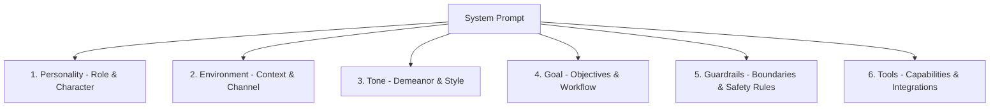
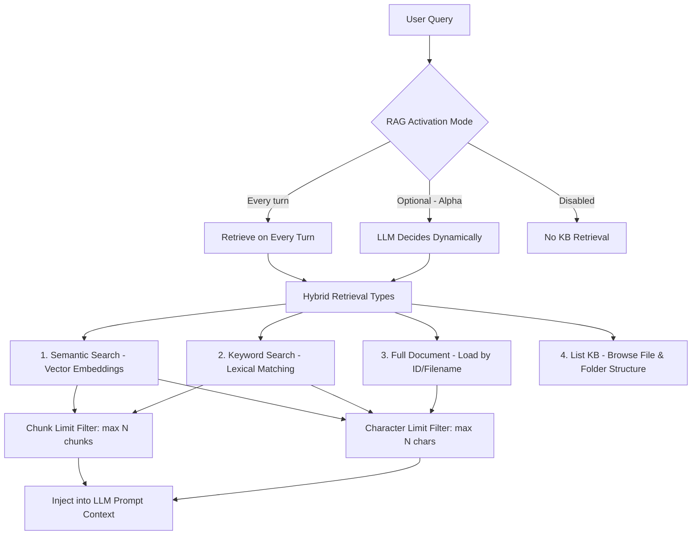
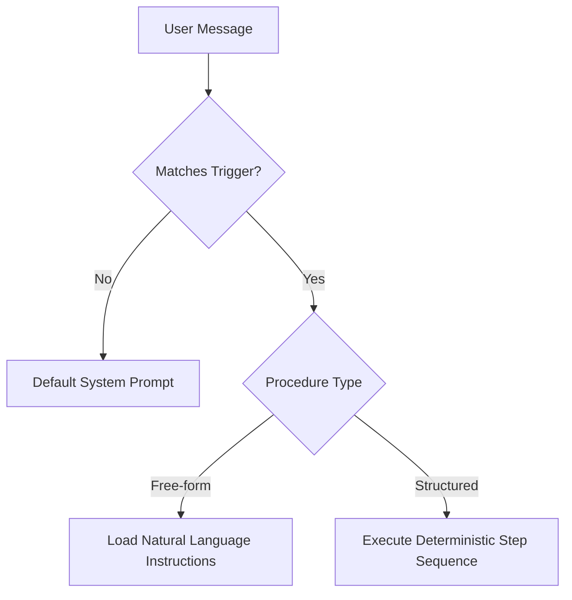

<!-- 
name: elevenlabs-guide
description: Comprehensive knowledge base, architectural overview, and configuration guide for ElevenLabs Conversational AI & Text-to-Speech platform.
-->

# ElevenLabs Conversational AI & TTS Platform Guide

Comprehensive in-depth documentation, configuration, and setup guide for ElevenLabs Conversational AI, Text-to-Speech (TTS), Speech-to-Text (STT), and custom Pronunciation Dictionaries.

---

## 1. Model & Audio Configuration (Model & Audio Config)

### 1.1. LLM for Agents (Large Language Models)
* **Diverse LLM Models:** Freely choose the processing brain for your Agent from today's leading language models (e.g., `Gemini 2.0 Flash` to optimize cost & speed, `Claude 3.5 Sonnet`, `GPT-4o`, etc.).
* **Custom LLM Models (Custom LLMs / Self-hosted):** Supports connecting and self-hosting enterprise proprietary LLM models to serve as specialized processing brains for Agents.
* **Parameter Tuning:** Adjust core parameters such as **Temperature** (creativity/randomness, recommended 0.0 - 0.7 for customer service agents) to control response precision and consistency.

---

### 1.2. STT & TTS (Speech-to-Text & Text-to-Speech)

#### TTS Output Format
The audio output format determines the balance between **Audio Quality**, **Bandwidth**, and **Latency**:

##### PCM Group (Pulse-Code Modulation)
PCM is an uncompressed raw audio format. Client devices (Web/Mobile) do not spend CPU resources decompressing the stream; however, the network payload size is larger compared to compressed formats (MP3):

* **PCM 8000 Hz:**
  * *Performance:* Extremely small data payload, lowest network transmission latency.
  * *Quality:* Very low, loses significant frequency ranges, sounds similar to walkie-talkies or vintage radios.
* **PCM 16000 Hz (Recommended for Real-time Agents):**
  * *Performance:* The "sweet spot" between payload size and response speed (Time-To-First-Byte).
  * *Quality:* Clear, captures the complete essential frequency band of human speech. Optimized for real-time AI Voice Agents.
* **PCM 22050 Hz & 24000 Hz:**
  * *Performance:* Consumes ~1.5x more bandwidth than 16kHz; slightly higher network latency.
  * *Quality:* Crisp, smooth voice output, suitable for podcast standards.
* **PCM 44100 Hz & 48000 Hz (Highest Quality):**
  * *Performance:* Heaviest payload (~3x larger than 16kHz), increasing latency and bandwidth usage.
  * *Quality:* CD standard (44.1kHz) and Studio/DVD standard (48kHz), covering the full audible human frequency spectrum. Best suited for offline audio rendering and video dubbing.

##### μ-law 8000 Hz Format (Telephony / VoIP)
* **Use Case:** μ-law (Mu-law) is the standard audio companding algorithm (G.711) in telecommunications, compressing signals to minimize transmission payload over voice channels.
* **Purpose:** Mandatory when integrating directly with VoIP PBX systems, SIP trunks, or traditional telephony infrastructures (Twilio, Asterisk).

---

## 2. Pronunciation Lexicon & Tuning (Pronunciation Dictionary)

When dealing with proper nouns, technical terms, brand names, or abbreviations, TTS models may mispronounce words. ElevenLabs provides **Pronunciation Dictionaries** to fine-tune exact pronunciations.

### 2.1. Dictionary File Format Preparation
* **Format:** Uses files with `.pls` extension (Pronunciation Lexicon Specification) based on standard W3C XML structure.
* **Supported Phonetic Alphabets:**
  * **IPA (International Phonetic Alphabet):** Provides the most granular control over each individual phoneme.
  * **CMU (Carnegie Mellon University Pronouncing Dictionary):** Uses simpler ASCII codes for English (e.g., `AE P AH L`).
* **Case-Sensitivity:** The system is strictly case-sensitive. You must define separate entries for uppercase and lowercase variants of the same word if both appear in the source text.

### 2.2. Standard `.pls` File Structure
Below is a sample W3C XML compliant file:

```xml
<?xml version="1.0" encoding="UTF-8"?>
<lexicon version="1.0" 
  xmlns="http://www.w3.org/2005/01/pronunciation-lexicon" 
  xmlns:xsi="http://www.w3.org/2001/XMLSchema-instance" 
  xsi:schemaLocation="http://www.w3.org/2005/01/pronunciation-lexicon 
  http://www.w3.org/TR/2007/CR-pronunciation-lexicon-20071212/pls.xsd" 
  alphabet="ipa" xml:lang="en-GB">
  
  <lexeme>
    <grapheme>Apple</grapheme>
    <phoneme>ˈæpl̩</phoneme>
  </lexeme>
  
  <lexeme>
    <grapheme>UN</grapheme>
    <alias>United Nations</alias>
  </lexeme>
</lexicon>
```

#### XML Tags Breakdown:
* `<lexeme>`: Definition block for a vocabulary entry / pronunciation rule.
* `<grapheme>`: The original text word you wish to override.
* `<phoneme>`: Contains the phonetic transcription string in IPA or CMU format.
* `<alias>`: Contains a plain-text substitution string (forces AI to read this phrase instead of the original word).

### 2.3. Operational Rules & Model Constraints

> [!IMPORTANT]
> **Model Constraints on `<phoneme>` Tag:**
> * The `<phoneme>` tag (IPA/CMU notation) **only works** on models: `eleven_flash_v2` and `eleven_v3`.
> * On other models (non-Flash V2 or V3), the system will **ignore the `<phoneme>` tag**. In such cases, you must use the `<alias>` tag for text substitution.

> [!TIP]
> **Multilingual Support:**
> * To apply IPA and CMU phonetic standards to **languages other than English**, you must switch to using the `eleven_v3` model.
> * Any words not explicitly defined in the `.pls` dictionary file will automatically follow the AI model's default pronunciation rules.

### 2.4. Uploading and Applying Configurations
1. Access the **ElevenLabs Dashboard** and select the Agent you want to configure.
2. Navigate to **Voice Settings**.
3. Click **Add a Pronunciation Dictionary** and upload the created `.pls` file. You can upload multiple independent dictionary files to manage by domain or language.
4. Click **Save Changes** to persist and apply settings to the Agent.

---

## 3. Persona Design via 6 Building Blocks (System Prompt Architecture)

The System Prompt is the core foundation defining the entire mindset and behavior of the Agent:



1. **Personality (Role & Identity):** Clearly define the Agent's identity (e.g., Professional financial advisor, calm, attentive).
2. **Environment (Context):** Define the interaction scenario (e.g., Handling hotline calls, answering website live chat...).
3. **Tone (Demeanor & Style):** Specify conversational style and tone (e.g., Courteous, warm, concise, and articulate).
4. **Goal (Objectives & Workflow):** Sequential steps the Agent needs to accomplish to resolve the user request.
5. **Guardrails (Safety & Boundaries):** Ethical boundaries, data privacy guidelines, preventing off-topic drift or unauthorized commitments.
6. **Tools (Integrated Capabilities):** Declare integrated tools directly in the prompt so the Agent knows when to trigger them.

---

## 4. Knowledge Base Integration & Hybrid RAG

ElevenLabs Conversational AI features a multimodal **Hybrid RAG (Retrieval-Augmented Generation)** system combining semantic search, exact keyword matching, and full document retrieval.



### 4.1. RAG Activation Modes (Enable RAG Modes)

The system allows configuring the trigger condition and frequency for knowledge retrieval:

* **Disabled:** Disables Knowledge Base lookup. The Agent relies solely on its System Prompt and integrated Tools.
* **Every turn:** The Agent automatically performs knowledge base retrieval on **every single user turn** before generating a response. Ideal for dedicated deep document retrieval agents.
* **Optional (Alpha - Smart Trigger):** The LLM autonomously analyzes user intent to decide when knowledge retrieval is needed. Helps reduce latency, save tokens, and avoid redundant context loading during casual pleasantries.

---

### 4.2. Hybrid Retrieval Types

You can flexibly activate single or multiple concurrent retrieval methods:

1. **Semantic Search:**
   * *Mechanism:* Automatically splits documents into chunks, generates vector embeddings, and performs similarity searches (Cosine Similarity).
   * *Use Case:* Handles natural language queries, varying phrasings, and conceptual questions with shared intent.
2. **Keyword Search (Lexical Matching):**
   * *Mechanism:* Performs text matching based on exact keywords and terms (Lexical / BM25 search).
   * *Use Case:* Looking up product codes, SKUs, contract numbers, proper technical nouns, or domain jargon that semantic search might miss.
3. **Full Document:**
   * *Mechanism:* Retrieves and loads the entire unmodified content of a specific document based on its ID or filename.
   * *Use Case:* When the Agent requires full, cohesive context of an entire document (warranty policies, complete contract terms) rather than fragmented excerpts.
4. **List (Browse Knowledge Directory):**
   * *Mechanism:* Exposes the complete list of files and directory hierarchy in the Knowledge Base to the Agent.
   * *Use Case:* Allows the Agent to "see" the high-level catalog of available documentation, empowering it to make informed decisions on which specific file to inspect via *Full Document* or targeted search.

---

### 4.3. Retrieval Limit Configurations (Retrieval Limits)

To manage Context Window size, optimize costs, and maintain rapid response times for real-time conversations, ElevenLabs provides two configurable boundary thresholds:

* **Character Limit:**
   * *Scope:* Applies across **Semantic**, **Keyword**, and **Full document** retrievals.
   * *Meaning:* Limits the total maximum number of text characters allowed to be extracted and injected into the prompt per query (default: `50,000` characters).
   * *Purpose:* Prevents LLM context window overflow when dealing with lengthy documents.
* **Chunk Limit:**
   * *Scope:* Applies specifically to **Semantic** and **Keyword** searches.
   * *Meaning:* Limits the maximum number of most relevant chunks retrieved per query (default: `20` chunks).
   * *Purpose:* Selects the highest scoring segments while filtering out noise.

---

### 4.4. Multi-Source Knowledge Ingestion & Management

* **Supported Data Sources:** Web page URLs (automatic crawling & syncing), direct document file uploads (`PDF`, `DOCX`, `TXT`, `MD`, `HTML`, `EPUB` - up to 20MB/file), or raw plain-text input.
* **Automated Management via REST API:** Full programmatic support to create, update, delete Knowledge Bases, trigger RAG re-indexing, and dynamically bind documents to Agent branches via the `/v1/convai/knowledge-base` API endpoint.

---

## 5. Tools & Integrations System

* **Server-side Webhook Tools:** Enable the Agent to make external API calls from ElevenLabs servers to your backend infrastructure (e.g., Order lookup, scheduling appointments):
  * Dynamic variables extraction (**Dynamic variables** such as JWT, User ID, Session ID).
  * Configurable timeout (**Response timeout**).
  * Interrupt locking while tools process (**Disable interruptions**).
  * Filler speech before tool execution (**Pre-tool speech**, e.g., "Please give me a moment while I check that for you...").
  * Authentication configuration (Bearer Token, API Key) and Custom HTTP Headers.
  * Schema-based tool management as JSON Schema via **Agent CLI**.
* **Client-side Tools:** Trigger direct client UI/UX actions on user Web/App interfaces (page redirection, element highlighting, opening modals, etc.) through the client SDK.
* **System Tools:** Built-in platform tools such as **Language Detection** (Automatic speaker language recognition).

---

## 6. Multilingual Capabilities

* **First Message Localization:** Automatically translates opening welcome messages into corresponding enabled user languages.
* **Dynamic Language Switching:** When **Language Detection** is enabled, the Agent automatically detects the spoken language and seamlessly switches language on-the-fly within the same session.

---

## 7. Professional Voice Design

* **Extensive Voice Library:** Choose from thousands of high-fidelity voices across diverse accents, genders, and age profiles.
* **Voice Parameter Tuning:**
  * **Stability:** Higher values produce a steady, consistent delivery; lower values introduce natural variety and emotional inflection.
  * **Speed:** Tune speaking tempo to match conversation dynamics.
  * **Similarity Boost / Style Exaggeration:** Enhances resemblance to the original voice and amplifies expressive style.

---

## 8. Security & Authentication

* **Domain Allowlists:** Restrict access so only authorized enterprise domains can establish connections with the Agent ID, preventing token theft and credit draining.
* **Signed URL Authentication:** Generate short-lived signed tokens via your backend server. Keeps the ElevenLabs API Key strictly secure on the server side while allowing fine-grained authorization and credit quotas per call session.

---

## 9. Channels & Deployment

* **Embed Widget (No-code):** Embed directly into web pages using an HTML `<script>` tag. Full visual customization: brand colors, animated Orb effects, widget sizing, and terms of service banners.
* **React & JavaScript SDK (WebRTC):** Build fully custom UI/UX experiences. The SDK natively handles WebRTC connections, turn-taking, ambient noise filtering, acoustic echo cancellation (AEC), and packet loss recovery.
* **Telephony Integration (Twilio SIP/Phone):** Synchronize Twilio phone numbers (Account SID & Auth Token) to automate inbound call centers and trigger outbound batch calling campaigns.
* **MCP & Workspace Connections:** Connect Model Context Protocol (MCP) servers, enabling Agents to interact seamlessly with internal enterprise tools and workflows.

---

## 10. Dedicated Task Procedures (Procedures)

Procedures are modular task-specific instruction sets that the Agent dynamically loads into its working context when triggered by designated user intent or conditions.

### 10.1. Overview & Comparison (Procedures Overview)

A Procedure consists of:
* **Trigger:** Describes when the Agent must activate this procedure (e.g., *When the user asks for a refund*).
* **Content:** Detailed execution instructions explaining what the Agent must do.

When user speech matches the Trigger, the Agent dynamically loads the corresponding Procedure into the active session.



#### Procedure Types & Selection Criteria

| Scenario Requirement | Recommended Solution | Rationale |
| :--- | :--- | :--- |
| **Proof of concept / Simple Agent** | **System Prompt Only** | Fastest iteration and setup; however, prompt becomes bloated and hard to maintain as features scale. |
| **Flexible wording & fluid step order** | **Free-form Procedure** | Keeps the entire dialogue in the LLM context; allows the Agent to improvise responses and navigate unexpected tangents naturally. Uses more context tokens. |
| **Deterministic step-by-step tasks** | **Structured Procedure** | Every step executes in a predefined order and consistent manner across all calls (identity verification, payments, call transfers...). |
| **Complex multi-agent graphs & transitions** | **Workflow** | Runs as a state graph connecting multiple subagents; provides full control over branching logic and assigns distinct LLMs per step. |

---

### 10.2. Free-form Procedures

Free-form Procedures describe tasks using natural language (Plain Markdown). The Agent interprets guidelines dynamically and adapts to live conversational flow. It can execute tools (including system tools like ending a call), look up the Knowledge Base, and transition to other Procedures.

#### Free-form Procedure Structure:
* **Name:** Internal identifier on the Dashboard (not sent to LLM).
* **Trigger:** Describes when the Agent runs the procedure (e.g., *When the user asks to refund, return, or get money back for an order*).
* **Content:** Markdown instructions. Use numbered lists for sequential steps and bullet points for sub-conditions.
* **Inline References:** Use the `/` shortcut in the UI editor or standard syntax via API:

```text
[tool id="tool_abc123"]
[kb id="kb_abc123"]
[procedure id="agtprc_abc123"]
[system_tool id="end_call"]
{{customer_id}}
```

#### Sub-procedures:
* Sub-procedures have an **empty Trigger**.
* Only triggered when referenced by another Procedure.
* Ideal for reusing shared subroutines (e.g., authentication, transferring to human agent).

#### Managing Free-form Procedures via API:

```python
from elevenlabs import CreateProcedureRequestModel, ElevenLabs

elevenlabs = ElevenLabs()

procedure = elevenlabs.conversational_ai.agents.procedures.create(
    agent_id="agent_7101k5zvyjhmfg983brhmhkd98n6",
    branch_id="agtbranch_0901k4aafjxxfxt93gd841r7tv5t",
    request=CreateProcedureRequestModel(
        name="Refund request",
        type="free_form",
        trigger="When the user asks to refund, return, or get money back for an order",
        content="Ask for the order ID, then look it up with [tool id=\"tool_abc123\"].",
    ),
)

print(procedure.procedure_id)
```

```typescript
import { ElevenLabsClient } from "@elevenlabs/elevenlabs-js";

const elevenlabs = new ElevenLabsClient();

const procedure = await elevenlabs.conversationalAi.agents.procedures.create(
  "agent_7101k5zvyjhmfg983brhmhkd98n6",
  "agtbranch_0901k4aafjxxfxt93gd841r7tv5t",
  {
    name: "Refund request",
    type: "free_form",
    trigger: "When the user asks to refund, return, or get money back for an order",
    content: "Ask for the order ID, then look it up with [tool id=\"tool_abc123\"].",
  }
);

console.log(procedure.procedureId);
```

---

### 10.3. Structured Procedures

Structured Procedures execute a sequence of typed steps (**Typed Steps**) deterministically and consistently across every call.

#### Step Types:

| Step | API Type | Description & Behavior |
| :--- | :--- | :--- |
| **Ask** | `ask` | Requests information from the user and **waits until** a valid response is received. |
| **Tell** | `tell` | Instructs the Agent to generate phrasing in its own words based on guidance (does not wait for user input). |
| **Say** | `say` | Forces the Agent to read verbatim the provided text string. |
| **Tool** | `tool_call` | Executes a specific Tool / API (supports `on_failure` fallback handling). |
| **If / Branch** | `branch` | Sequential conditional branching (using `llm` or `expression` conditions). Supports `fallback` (else) block. |
| **Sub-procedure** | `sub_procedure` | Calls another Structured Procedure, then resumes next step upon return. |
| **System tool** | `system_tool` | Executes built-in system action (e.g., `end_call` - terminates call session). |
| **Retry** | `retry` | Retries failed Tool step (valid exclusively within `on_failure`). |

#### Complete JSON Schema Example:

```json
{
  "trigger": "When the user asks to cancel an order and request a refund.",
  "steps": [
    {
      "type": "ask",
      "instruction": "Ask the user for their order ID."
    },
    {
      "type": "branch",
      "branches": [
        {
          "condition": {
            "type": "llm",
            "condition": "The user says the order has already shipped."
          },
          "steps": [
            {
              "type": "tell",
              "instruction": "Explain that shipped orders must be returned before they can be refunded."
            }
          ]
        },
        {
          "condition": {
            "type": "llm",
            "condition": "The user says the order has not shipped."
          },
          "steps": [
            {
              "type": "tool_call",
              "tool_id": "tool_abc123",
              "tool_name": "cancel_order",
              "instruction": "Cancel the order using the order ID provided by the user.",
              "on_failure": {
                "fallback": [
                  {
                    "type": "retry",
                    "max_retries": 2
                  }
                ]
              }
            }
          ]
        }
      ],
      "fallback": [
        {
          "type": "ask",
          "instruction": "Ask whether the order has already shipped."
        }
      ]
    },
    {
      "type": "sub_procedure",
      "procedure_id": "agtprc_6qbpwdq8n01bxhk44bgjy6f10ck3"
    },
    {
      "type": "say",
      "message": "Thank you for contacting us. Goodbye."
    },
    {
      "type": "system_tool",
      "system_tool_name": "end_call"
    }
  ]
}
```

#### Compile & Publish Workflow:

> [!WARNING]
> When creating or editing Structured Procedure drafts via API, you **must** call the `/procedures/compile` endpoint before updating the Agent to generate the corresponding workflow nodes. Failing to do so may leave the workflow with outdated, missing, or orphaned nodes.

```python
import json
from elevenlabs import ElevenLabs

elevenlabs = ElevenLabs()

# 1. Update draft procedure
elevenlabs.conversational_ai.agents.procedures.drafts.update(
    agent_id="agent_7101k5zvyjhmfg983brhmhkd98n6",
    branch_id="agtbranch_0901k4aafjxxfxt93gd841r7tv5t",
    procedure_id="agtprc_6qbpwdq8n01bxhk44bgjy6f10ck3",
    name="Refund request",
    type="deterministic",
    trigger="When the user asks to refund an order",
    content=json.dumps({
        "trigger": "When the user asks to refund an order",
        "steps": [{"type": "ask", "instruction": "Ask for the order ID."}]
    })
)

# 2. Compile workflow from structured drafts
compiled = elevenlabs.conversational_ai.agents.procedures.compile(
    agent_id="agent_7101k5zvyjhmfg983brhmhkd98n6",
    branch_id="agtbranch_0901k4aafjxxfxt93gd841r7tv5t",
)

# 3. Publish new Agent version with compiled workflow
elevenlabs.conversational_ai.agents.update(
    agent_id="agent_7101k5zvyjhmfg983brhmhkd98n6",
    branch_id="agtbranch_0901k4aafjxxfxt93gd841r7tv5t",
    workflow=compiled.workflow,
)
```

---

### 10.4. Best Practices & Technical Limitations

#### Trigger & Content Design Principles:
* **Specific and non-overlapping triggers:** Avoid ambiguous triggers (prefer *"When the user asks to cancel a subscription"* over *"When the user asks about account"*).
* **Perspective of the user:** Write triggers describing what the user says or wants, not what the Agent does.
* **Cover diverse phrasing variations:** *"When the user wants to refund, return, or get money back"* triggers much more reliably than a simple *"When the user asks for a refund"*.
* **Use imperative mood for execution steps:** Write *"Look up recent order"* instead of *"You should look up the order"*.
* **Explain rationale for steps:** Providing concise context (*"because we need the ID to generate a refund ticket"*) empowers the LLM to navigate edge cases effectively.

#### Technical Limitations:
* Each Procedure content is capped at a maximum of **50,000 characters**.
* Cannot alter `type` (Free-form <-> Structured) after creation.
* Procedures are scoped directly to an individual Agent and cannot be shared across the entire workspace directly.
* Structured Procedures cannot directly reference Knowledge Base documents.
* Nested If steps inside another If step are not supported; avoid placing consecutive If steps back-to-back.
* Leading frontier models from OpenAI, Anthropic, Gemini, and Grok provide optimal support for Forced Tool Choice to ensure reliable step transitions in Structured Procedures.
