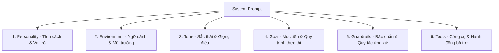
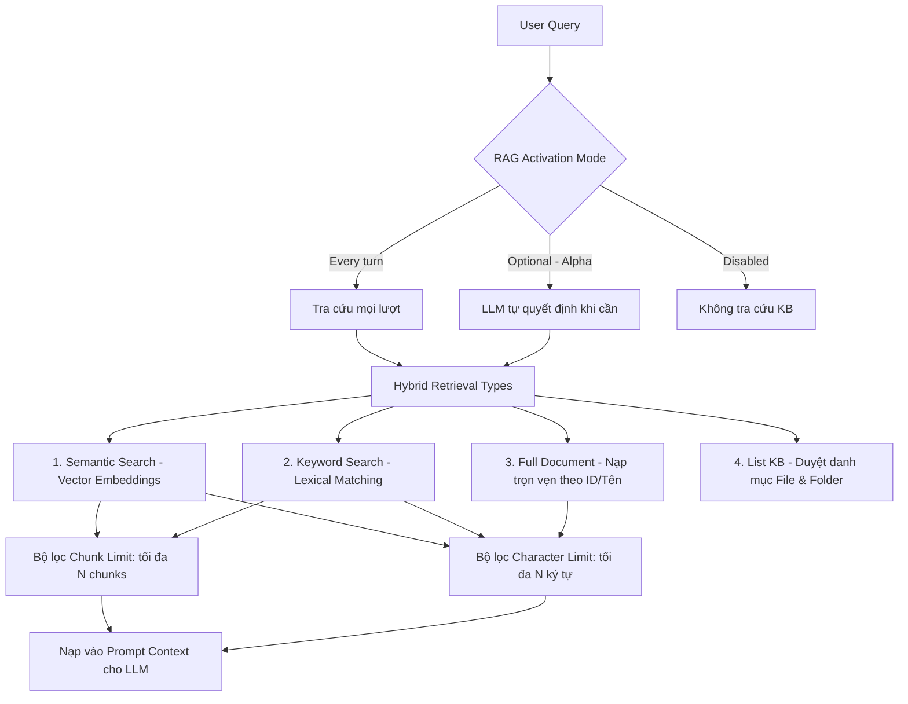
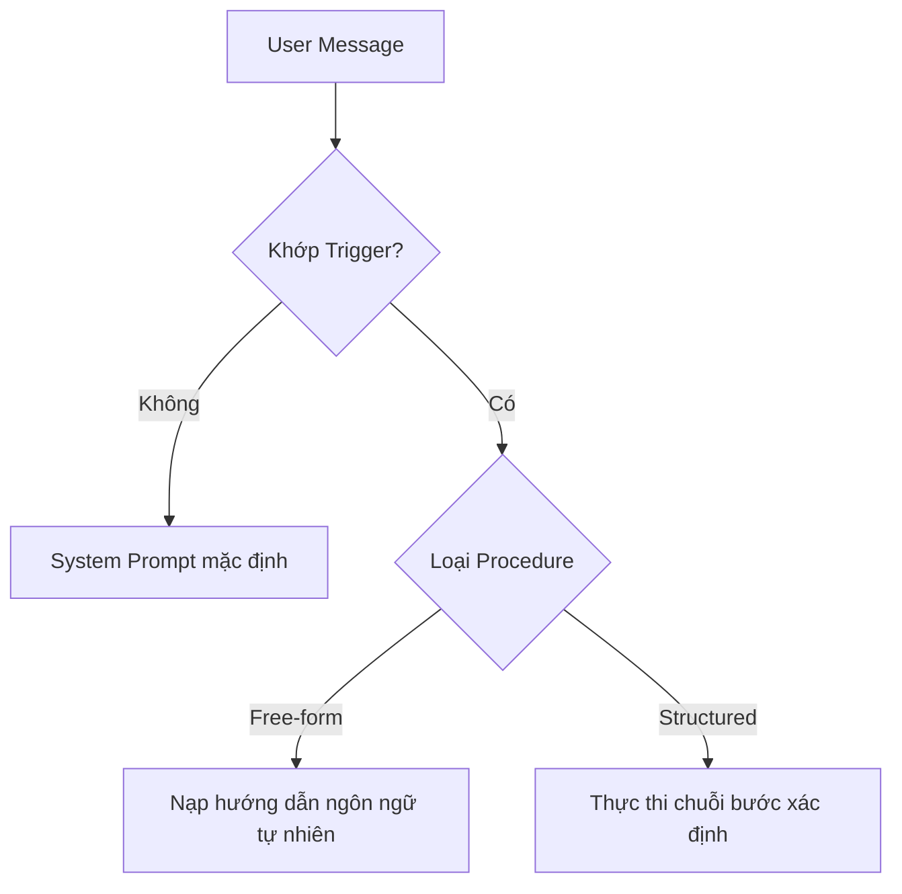

<!-- 
name: elevenlabs-guide
description: Comprehensive knowledge base, architectural overview, and configuration guide for ElevenLabs Conversational AI & Text-to-Speech platform.
-->

# ElevenLabs Conversational AI & TTS Platform Guide

Tài liệu tổng hợp kiến thức chuyên sâu, hướng dẫn cấu hình và thiết lập hệ thống ElevenLabs Conversational AI, Text-to-Speech (TTS), Speech-to-Text (STT), và bộ từ điển phát âm tùy chỉnh (Pronunciation Dictionary).

---

## 1. Cấu hình Mô hình & Bộ xử lý Âm thanh (Model & Audio Config)

### 1.1. LLM cho Agent (Large Language Models)
* **Đa dạng mô hình LLM:** Tự do lựa chọn bộ não xử lý cho Agent từ các mô hình ngôn ngữ hàng đầu hiện nay (ví dụ: `Gemini 2.0 Flash` để tối ưu chi phí & tốc độ, `Claude 3.5 Sonnet`, `GPT-4o`...).
* **Mô hình LLM tùy chỉnh (Custom LLMs / Self-hosted):** Hỗ trợ kết nối và tự lưu trữ mô hình LLM riêng của doanh nghiệp để đưa vào Agent làm bộ não xử lý chuyên biệt.
* **Tinh chỉnh tham số:** Điều chỉnh các thuộc tính cơ bản như **Temperature** (độ sáng tạo/ngẫu nhiên, khuyến nghị 0.0 - 0.7 cho agent dịch vụ) để kiểm soát độ chính xác của phản hồi.

---

### 1.2. STT & TTS (Speech-to-Text & Text-to-Speech)

#### TTS Output Format (Định dạng đầu ra âm thanh)
Định dạng âm thanh đầu ra quyết định sự cân bằng giữa **chất lượng âm thanh (Quality)**, **băng thông (Bandwidth)** và **độ trễ (Latency)**:

##### Nhóm PCM (Pulse-Code Modulation)
PCM là định dạng âm thanh thô (uncompressed). Thiết bị client (Web/Mobile) không tốn tài nguyên CPU để giải nén, tuy nhiên kích thước payload truyền qua mạng lớn hơn định dạng nén (MP3):

* **PCM 8000 Hz:**
  * *Hiệu năng:* Dung lượng dữ liệu cực nhỏ, độ trễ truyền tải thấp nhất.
  * *Chất lượng:* Rất thấp, mất nhiều dải âm, chất âm giống bộ đàm hoặc đài radio cũ.
* **PCM 16000 Hz (Khuyến nghị cho Real-time Agent):**
  * *Hiệu năng:* Điểm "cân bằng vàng" giữa kích thước payload và tốc độ phản hồi (Time-To-First-Byte).
  * *Chất lượng:* Rõ ràng, ghi nhận trọn vẹn dải tần số chính của giọng nói con người. Tối ưu cho AI Voice Agent thời gian thực.
* **PCM 22050 Hz & 24000 Hz:**
  * *Hiệu năng:* Tốn băng thông hơn ~1.5 lần so với 16kHz; độ trễ mạng tăng nhẹ.
  * *Chất lượng:* Giọng đọc trong trẻo, mượt mà, đạt chuẩn podcast.
* **PCM 44100 Hz & 48000 Hz (Highest Quality):**
  * *Hiệu năng:* Payload nặng nhất (gấp ~3 lần mức 16kHz), tăng độ trễ và tiêu hao băng thông.
  * *Chất lượng:* Đạt chuẩn CD (44.1kHz) và Studio/DVD (48kHz), bao phủ toàn bộ dải âm thanh tai người nghe được. Phù hợp render audio lồng tiếng video/offline.

##### Định dạng μ-law 8000 Hz (Telephony / VoIP)
* **Ứng dụng:** μ-law (Mu-law) là thuật toán nén âm thanh tiêu chuẩn (G.711) trong ngành viễn thông. Nén tín hiệu để tối thiểu hóa dung lượng truyền tải qua đường truyền thoại.
* **Mục đích:** Bắt buộc khi tích hợp trực tiếp vào tổng đài điện thoại VoIP, SIP trunk, hoặc hạ tầng viễn thông truyền thống (Twilio, Asterisk).

---

## 2. Hiệu chỉnh Phát âm & Từ điển Lexicon (Pronunciation Dictionary)

Khi làm việc với các danh từ riêng, thuật ngữ kỹ thuật, tên thương hiệu hoặc từ viết tắt, mô hình TTS có thể phát âm sai. ElevenLabs hỗ trợ thiết lập **Pronunciation Dictionary** để tinh chỉnh chính xác cách đọc.

### 2.1. Chuẩn bị định dạng file từ điển
* **Định dạng:** Sử dụng file có phần mở rộng `.pls` (Pronunciation Lexicon Specification) dựa trên cấu trúc chuẩn XML (W3C).
* **Chuẩn ký hiệu phát âm hỗ trợ:**
  * **IPA (Bảng ký hiệu ngữ âm quốc tế):** Cho phép kiểm soát chính xác nhất từng âm vị của từ.
  * **CMU (Carnegie Mellon University Pronouncing Dictionary):** Sử dụng mã ASCII đơn giản hơn cho tiếng Anh (ví dụ: `AE P AH L`).
* **Phân biệt chữ hoa / chữ thường (Case-Sensitivity):** Hệ thống phân biệt rõ ràng chữ hoa và thường. Bạn cần khai báo mục riêng biệt cho từng phiên bản viết hoa/viết thường của cùng một từ nếu cả hai dạng đều xuất hiện trong văn bản.

### 2.2. Cấu trúc file `.pls` chuẩn
Dưới đây là cấu trúc file mẫu chuẩn XML:

```xml
<?xml version="1.0" encoding="UTF-8"?>
<lexicon version="1.0" 
  xmlns="http://www.w3.org/2005/01/pronunciation-lexicon" 
  xmlns:xsi="http://www.w3.org/2001/XMLSchema-instance" 
  xsi:schemaLocation="http://www.w3.org/2005/01/pronunciation-lexicon 
  http://www.w3.org/TR/2007/CR-pronunciation-lexicon-20071212/pls.xsd" 
  alphabet="ipa" xml:lang="en-GB">
  
  <lexeme>
    <grapheme>Apple</grapheme>
    <phoneme>ˈæpl̩</phoneme>
  </lexeme>
  
  <lexeme>
    <grapheme>UN</grapheme>
    <alias>United Nations</alias>
  </lexeme>
</lexicon>
```

#### Chi tiết các thẻ XML:
* `<lexeme>`: Khối định nghĩa cho một từ vựng / cách phát âm.
* `<grapheme>`: Chứa từ gốc trong văn bản mà bạn muốn can thiệp cách phát âm.
* `<phoneme>`: Chứa chuỗi ký hiệu ngữ âm theo chuẩn IPA hoặc CMU.
* `<alias>`: Chứa chuỗi văn bản thay thế bằng chữ thông thường (ép AI đọc cụm từ này thay cho từ gốc).

### 2.3. Quy tắc hoạt động & Giới hạn mô hình

> [!IMPORTANT]
> **Giới hạn thẻ `<phoneme>` theo mô hình:**
> * Thẻ `<phoneme>` (ký hiệu IPA/CMU) **chỉ hoạt động** trên các mô hình: `eleven_flash_v2` và `eleven_v3`.
> * Với các mô hình khác (không phải Flash V2 hoặc V3), hệ thống sẽ **bỏ qua thẻ `<phoneme>`**. Trong trường hợp này, bạn bắt buộc phải dùng thẻ `<alias>` để thay thế từ ngữ mong muốn.

> [!TIP]
> **Hỗ trợ Đa ngôn ngữ:**
> * Nếu muốn áp dụng chuẩn ngữ âm IPA và CMU cho **các ngôn ngữ khác ngoài tiếng Anh**, bạn bắt buộc phải chuyển sang sử dụng mô hình `eleven_v3`.
> * Bất kỳ từ ngữ nào không được khai báo trong file từ điển `.pls` sẽ tự động tuân theo quy tắc phát âm mặc định của mô hình AI.

### 2.4. Hướng dẫn tải lên và áp dụng cấu hình
1. Truy cập vào **ElevenLabs Dashboard** và chọn Agent cần cấu hình.
2. Điều hướng đến mục **Voice Settings** (Cài đặt giọng nói).
3. Nhấp chọn **Add a Pronunciation Dictionary** (Thêm từ điển phát âm) và tải lên file `.pls` đã tạo. Có thể tải lên nhiều file từ điển độc lập để quản lý theo từng nhóm chủ đề/ngôn ngữ.
4. Nhấn **Save Changes** để lưu và áp dụng cho Agent.

---

## 3. Thiết kế Persona qua 6 Khối Xây dựng (6 Building Blocks of System Prompt)

System Prompt là nền tảng cốt lõi định hình toàn bộ tư duy và hành vi của Agent:



1. **Personality (Tính cách & Vai trò):** Định vị cụ thể danh tính của Agent (ví dụ: Chuyên viên tư vấn tài chính chuyên nghiệp, điềm đạm, lắng nghe).
2. **Environment (Môi trường):** Định nghĩa ngữ cảnh tương tác (ví dụ: Đang tiếp nhận cuộc gọi hotline, hỗ trợ live chat trên website...).
3. **Tone (Giọng điệu):** Quy định sắc thái ngôn ngữ (ví dụ: Lịch sự, ấm áp, ngắn gọn, súc tích).
4. **Goal (Mục tiêu):** Chuỗi các bước tuần tự Agent cần hoàn thành để giải quyết yêu cầu của người dùng.
5. **Guardrails (Rào chắn an toàn):** Ranh giới đạo đức, quy tắc bảo mật dữ liệu, tránh trả lời lạc đề hoặc cam kết ngoài thẩm quyền.
6. **Tools (Công cụ tích hợp):** Khai báo các công cụ bổ trợ trực tiếp vào Prompt để Agent biết thời điểm kích hoạt.

---

## 4. Tích hợp Cơ sở tri thức (Knowledge Base & Hybrid RAG)

ElevenLabs Conversational AI cung cấp hệ thống **Hybrid RAG (Retrieval-Augmented Generation)** đa phương thức kết hợp giữa tìm kiếm ngữ nghĩa, từ khóa chính xác và tra cứu toàn văn tài liệu.



### 4.1. Chế độ Kích hoạt RAG (Enable RAG Modes)

Hệ thống cho phép cấu hình tần suất và điều kiện kích hoạt truy xuất tri thức:

* **Disabled (Tắt):** Vô hiệu hóa tính năng tra cứu Knowledge Base. Agent chỉ dựa vào System Prompt và các Tools tích hợp.
* **Every turn (Mỗi lượt thoại):** Agent tự động thực hiện truy xuất cơ sở tri thức ở **mọi lượt hội thoại** của người dùng trước khi sinh câu trả lời. Phù hợp cho Agent chuyên trách tra cứu tài liệu sâu.
* **Optional (Alpha - Tùy chọn thông minh):** Mô hình LLM tự phân tích ý định (Intent) của người dùng để quyết định thời điểm cần tra cứu tri thức. Giúp giảm độ trễ (latency), tiết kiệm token và tránh nạp dữ liệu thừa khi chỉ chào hỏi thông thường.

---

### 4.2. Các Phương thức Truy xuất Tri thức (Hybrid Retrieval Types)

Bạn có thể kích hoạt linh hoạt một hoặc kết hợp đồng thời nhiều phương thức truy xuất:

1. **Semantic (Tìm kiếm Ngữ nghĩa):**
   * *Cơ chế:* Tự động chia nhỏ tài liệu thành các chunks, tạo vector embeddings và tìm kiếm theo độ tương đồng ngữ nghĩa (Cosine Similarity).
   * *Ứng dụng:* Xử lý câu hỏi tự nhiên, câu hỏi diễn đạt theo nhiều cách khác nhau nhưng cùng chung ý nghĩa.
2. **Keyword (Tìm kiếm Từ khóa Chính xác):**
   * *Cơ chế:* Tìm kiếm văn bản dựa trên đối sánh từ khóa/thuật ngữ chính xác (Lexical / BM25 search).
   * *Ứng dụng:* Tra cứu mã sản phẩm, SKU, số hiệu hợp đồng, tên riêng kỹ thuật hoặc thuật ngữ chuyên ngành mà tìm kiếm ngữ nghĩa có thể bỏ sót.
3. **Full Document (Toàn văn Tài liệu):**
   * *Cơ chế:* Truy xuất và tải toàn bộ nội dung nguyên vẹn của một tài liệu cụ thể dựa trên ID hoặc tên file.
   * *Ứng dụng:* Khi Agent cần nắm bắt ngữ cảnh liền mạch của một văn bản hoàn chỉnh (chính sách bảo hành, điều khoản hợp đồng) thay vì các đoạn trích rời rạc.
4. **List (Liệt kê Danh mục Tri thức):**
   * *Cơ chế:* Cung cấp cho Agent danh sách toàn bộ tài liệu và cấu trúc thư mục hiện có trong Knowledge Base.
   * *Ứng dụng:* Giúp Agent "nhìn thấy" bức tranh tổng thể về kho tài liệu hiện có, từ đó tự đưa ra quyết định chọn đúng file cụ thể cần đọc sâu bằng *Full Document* hoặc tra cứu chuyên biệt.

---

### 4.3. Cấu hình Giới hạn Truy xuất (Retrieval Limits)

Để kiểm soát dung lượng Context Window, tối ưu chi phí và duy trì tốc độ phản hồi nhanh nhất cho đàm thoại thời gian thực, ElevenLabs cho phép cấu hình 2 ngưỡng giới hạn:

* **Character Limit (Giới hạn Ký tự):**
  * *Phạm vi áp dụng:* Áp dụng chung cho **Semantic**, **Keyword**, và **Full document**.
  * *Ý nghĩa:* Giới hạn tổng số lượng ký tự văn bản tối đa được phép trích xuất và đưa vào prompt trong một lần truy vấn (ví dụ mặc định: `50,000` ký tự).
  * *Mục đích:* Ngăn chặn tình trạng tràn bộ nhớ ngữ cảnh của LLM khi đọc các tài liệu quá dài.
* **Chunk Limit (Giới hạn Số Chunks):**
  * *Phạm vi áp dụng:* Áp dụng riêng cho **Semantic** và **Keyword**.
  * *Ý nghĩa:* Giới hạn số lượng đoạn trích (chunks) liên quan nhất được lấy ra cho mỗi truy vấn (ví dụ mặc định: `20` chunks).
  * *Mục đích:* Lọc lấy các đoạn có điểm tương quan cao nhất, loại bỏ nhiễu thông tin.

---

### 4.4. Nạp và Quản trị Tri thức Đa nguồn

* **Nguồn dữ liệu hỗ trợ:** Nạp qua đường dẫn URL website (tự động crawl & đồng bộ), tải file tài liệu trực tiếp (`PDF`, `DOCX`, `TXT`, `MD`, `HTML`, `EPUB` - tối đa 20MB/file), hoặc nhập văn bản trực tiếp.
* **Quản trị tự động qua REST API:** Hỗ trợ tạo, cập nhật, xóa Knowledge Base, index lại RAG, và gán tài liệu động vào từng nhánh Agent thông qua API `/v1/convai/knowledge-base`.

---

## 5. Hệ thống Công cụ Tùy chỉnh (Tools & Integrations)

* **Server-side Webhook Tools:** Cho phép Agent thực hiện API call từ server ElevenLabs đến hệ thống backend của bạn (ví dụ: Tra cứu đơn hàng, đặt lịch khám):
  * Trích xuất biến động (**Dynamic variables** như JWT, User ID, Session ID).
  * Giới hạn thời gian phản hồi (**Response timeout**).
  * Khóa ngắt lời khi tool đang xử lý (**Disable interruptions**).
  * Câu thoại chờ trước khi tool thực thi (**Pre-tool speech**, ví dụ: "Xin vui lòng đợi em kiểm tra một chút...").
  * Cấu hình xác thực (Bearer Token, API Key) và Custom HTTP Headers.
  * Quản lý công cụ dưới dạng JSON Schema qua **Agent CLI**.
* **Client-side Tools:** Kích hoạt các hành động giao diện trực tiếp trên Web/App của người dùng (chuyển hướng trang, highlight phần tử, mở modal...) thông qua SDK.
* **System Tools:** Các công cụ dựng sẵn như **Language Detection** (Tự động nhận diện ngôn ngữ người nói).

---

## 6. Khả năng Hỗ trợ Đa ngôn ngữ (Multilingual)

* **Bản địa hóa câu chào (First Message):** Hỗ trợ dịch tự động câu thoại mở đầu sang các ngôn ngữ kích hoạt tương ứng.
* **Tự động chuyển đổi ngôn ngữ (Dynamic Language Switching):** Khi bật **Language Detection**, Agent tự động phát hiện ngôn ngữ người dùng đang nói và chuyển ngữ thoại tương ứng ngay trong cùng một phiên trò chuyện.

---

## 7. Thiết kế Giọng nói Chuyên nghiệp (Voice Design)

* **Thư viện Voice đa dạng:** Chọn lựa từ hàng nghìn giọng đọc chất lượng cao với đầy đủ ngữ điệu (accent), giới tính, và độ tuổi.
* **Tinh chỉnh tham số giọng:**
  * **Stability (Độ ổn định):** Giá trị càng cao giọng càng đều và ổn định; giá trị thấp giọng biến hóa tự nhiên, biểu cảm hơn.
  * **Speed (Tốc độ nói):** Tùy chỉnh tốc độ đọc phù hợp với phong cách hội thoại.
  * **Similarity Boost / Style Exaggeration:** Tăng cường độ giống với giọng gốc và mức độ biểu cảm.

---

## 8. Bảo mật và Xác thực (Security & Authentication)

* **Allowlists (Danh sách trắng Domain):** Giới hạn chỉ cho phép các domain chính thức kết nối với Agent ID, ngăn chặn đánh cắp ID và lạm dụng credits.
* **Signed URL Authentication:** Sử dụng backend server để sinh URL tạm thời có chữ ký số (signed token ngắn hạn). Giúp bảo vệ an toàn tuyệt đối ElevenLabs API Key, cho phép phân quyền và giới hạn hạn mức credits cho từng phiên gọi.

---

## 9. Triển khai Đa kênh (Channels & Deployment)

* **Embed Widget (No-code):** Nhúng trực tiếp vào website qua thẻ HTML `<script>`. Tùy chỉnh visual trực tiếp: màu sắc thương hiệu, hiệu ứng Orb hoạt họa, kích thước widget, điều khoản dịch vụ.
* **React & JavaScript SDK (WebRTC):** Tự xây dựng UI/UX hoàn toàn tùy biến. SDK tự động xử lý WebRTC, quản lý luân phiên trò chuyện (turn-taking), lọc ồn, khử tiếng vang (echo cancellation) và quản lý mất gói tin (packet loss).
* **Telephony Integration (Twilio SIP/Phone):** Đồng bộ trực tiếp số điện thoại từ Twilio (Account SID & Auth Token) để tự động hóa tổng đài tiếp nhận cuộc gọi đến (Inbound) và gọi ra tự động hàng loạt (Outbound/Batch Calling).
* **MCP & Workspace Connections:** Hỗ trợ kết nối máy chủ Model Context Protocol (MCP) để Agent tương tác với các công cụ nội bộ trong workflow doanh nghiệp.

---

## 10. Quy trình Tác vụ Chuyên biệt (Procedures)

Procedures là tập hợp các hướng dẫn cho một tác vụ cụ thể mà Agent sẽ tải vào ngữ cảnh khi người dùng kích hoạt đúng điều kiện (Trigger).

### 10.1. Tổng quan & So sánh (Procedures Overview)

Một Procedure bao gồm:
* **Trigger (Điều kiện kích hoạt):** Mô tả thời điểm Agent cần áp dụng quy trình này (ví dụ: *Khi khách hàng yêu cầu hoàn tiền*).
* **Content (Nội dung thực thi):** Mô tả chi tiết những gì Agent cần làm.

Khi cuộc trò chuyện khớp với Trigger, Agent sẽ nạp Procedure tương ứng vào phiên xử lý.



#### Phân loại Procedure & Tiêu chí lựa chọn

| Yêu cầu kịch bản | Giải pháp khuyến nghị | Lý do áp dụng |
| :--- | :--- | :--- |
| **Proof of concept / Agent đơn giản** | **Chỉ dùng System Prompt** | Cài đặt và lặp nhanh nhất, tuy nhiên prompt sẽ phình to và khó quản lý khi mở rộng tính năng. |
| **Tác vụ linh hoạt lời thoại & thứ tự** | **Free-form Procedure** | Giữ toàn bộ hội thoại trong ngữ cảnh LLM; Agent tự do ứng biến câu từ, xử lý rẽ nhánh bất ngờ. Tiêu tốn nhiều context window hơn. |
| **Tác vụ cố định từng bước (Deterministic)** | **Structured Procedure** | Mỗi bước chạy theo thứ tự định sẵn, cùng một cách thức trong mọi cuộc gọi (xác minh danh tính, thanh toán, chuyển máy...). |
| **Rẽ nhánh phức tạp & chuyển giao đa mô hình** | **Workflow** | Chạy dưới dạng đồ thị (graph) gồm nhiều subagents kết nối với nhau; toàn quyền kiểm soát rẽ nhánh và chọn LLM riêng cho từng bước. |

---

### 10.2. Quy trình Tự do (Free-form Procedures)

Free-form Procedure mô tả tác vụ bằng ngôn ngữ tự nhiên (Plain Markdown). Agent diễn giải hướng dẫn và thích ứng linh hoạt với tình huống thực tế. Có thể gọi công cụ (bao gồm system tools như ngắt cuộc gọi), tra cứu Knowledge Base và liên kết sang Procedure khác.

#### Cấu trúc Free-form Procedure:
* **Name:** Tên định danh nội bộ trên Dashboard (không gửi đến LLM).
* **Trigger:** Mô tả thời điểm Agent chạy procedure (ví dụ: *When the user asks to refund, return, or get money back for an order*).
* **Content:** Hướng dẫn bằng Markdown. Dùng các bước đánh số cho hành động tuần tự và gạch đầu dòng cho các điều kiện con.
* **Inline References (Tham chiếu nội dòng):** Sử dụng ký tự `/` trong giao diện editor hoặc cú pháp chuẩn qua API:

```text
[tool id="tool_abc123"]
[kb id="kb_abc123"]
[procedure id="agtprc_abc123"]
[system_tool id="end_call"]
{{customer_id}}
```

#### Sub-procedures (Quy trình phụ):
* Sub-procedure có **Trigger để trống**.
* Chỉ được kích hoạt khi có một Procedure khác tham chiếu đến nó.
* Phù hợp để tái sử dụng các bước dùng chung (ví dụ: xác thực danh tính, chuyển tiếp nhân viên hỗ trợ).

#### Quản lý Free-form Procedure qua API:

```python
from elevenlabs import CreateProcedureRequestModel, ElevenLabs

elevenlabs = ElevenLabs()

procedure = elevenlabs.conversational_ai.agents.procedures.create(
    agent_id="agent_7101k5zvyjhmfg983brhmhkd98n6",
    branch_id="agtbranch_0901k4aafjxxfxt93gd841r7tv5t",
    request=CreateProcedureRequestModel(
        name="Refund request",
        type="free_form",
        trigger="When the user asks to refund, return, or get money back for an order",
        content="Ask for the order ID, then look it up with [tool id=\"tool_abc123\"].",
    ),
)

print(procedure.procedure_id)
```

```typescript
import { ElevenLabsClient } from "@elevenlabs/elevenlabs-js";

const elevenlabs = new ElevenLabsClient();

const procedure = await elevenlabs.conversationalAi.agents.procedures.create(
  "agent_7101k5zvyjhmfg983brhmhkd98n6",
  "agtbranch_0901k4aafjxxfxt93gd841r7tv5t",
  {
    name: "Refund request",
    type: "free_form",
    trigger: "When the user asks to refund, return, or get money back for an order",
    content: "Ask for the order ID, then look it up with [tool id=\"tool_abc123\"].",
  }
);

console.log(procedure.procedureId);
```

---

### 10.3. Quy trình Có cấu trúc (Structured Procedures)

Structured Procedure thực thi một chuỗi các bước có định kiểu (**Typed Steps**) tuần tự và nhất quán trong mọi cuộc gọi.

#### Các loại bước (Step Types):

| Bước (Step) | API Type | Ý nghĩa & Hành vi |
| :--- | :--- | :--- |
| **Ask** | `ask` | Yêu cầu thông tin từ người dùng và **chờ cho đến khi** nhận được câu trả lời hợp lệ. |
| **Tell** | `tell` | Yêu cầu Agent tự tạo một câu thoại bằng ngôn từ của nó dựa trên chỉ dẫn (không chờ người dùng). |
| **Say** | `say` | Ép Agent đọc chính xác từng từ trong chuỗi văn bản được cung cấp. |
| **Tool** | `tool_call` | Gọi một Tool / API cụ thể (hỗ trợ khối xử lý lỗi `on_failure`). |
| **If / Branch** | `branch` | Rẽ nhánh điều kiện tuần tự (dùng điều kiện `llm` hoặc `expression`). Hỗ trợ khối `fallback` (else). |
| **Sub-procedure** | `sub_procedure` | Gọi một Structured Procedure khác rồi quay lại bước tiếp theo. |
| **System tool** | `system_tool` | Thực thi tác vụ hệ thống tích hợp sẵn (ví dụ: `end_call` - kết thúc cuộc gọi). |
| **Retry** | `retry` | Thử lại Tool step khi gặp lỗi (chỉ hợp lệ bên trong `on_failure`). |

#### Cấu trúc JSON Schema hoàn chỉnh:

```json
{
  "trigger": "When the user asks to cancel an order and request a refund.",
  "steps": [
    {
      "type": "ask",
      "instruction": "Ask the user for their order ID."
    },
    {
      "type": "branch",
      "branches": [
        {
          "condition": {
            "type": "llm",
            "condition": "The user says the order has already shipped."
          },
          "steps": [
            {
              "type": "tell",
              "instruction": "Explain that shipped orders must be returned before they can be refunded."
            }
          ]
        },
        {
          "condition": {
            "type": "llm",
            "condition": "The user says the order has not shipped."
          },
          "steps": [
            {
              "type": "tool_call",
              "tool_id": "tool_abc123",
              "tool_name": "cancel_order",
              "instruction": "Cancel the order using the order ID provided by the user.",
              "on_failure": {
                "fallback": [
                  {
                    "type": "retry",
                    "max_retries": 2
                  }
                ]
              }
            }
          ]
        }
      ],
      "fallback": [
        {
          "type": "ask",
          "instruction": "Ask whether the order has already shipped."
        }
      ]
    },
    {
      "type": "sub_procedure",
      "procedure_id": "agtprc_6qbpwdq8n01bxhk44bgjy6f10ck3"
    },
    {
      "type": "say",
      "message": "Thank you for contacting us. Goodbye."
    },
    {
      "type": "system_tool",
      "system_tool_name": "end_call"
    }
  ]
}
```

#### Quy trình Biên dịch & Xuất bản (Compile & Publish Workflow):

> [!WARNING]
> Khi tạo/sửa Structured Procedure draft qua API, bạn **bắt buộc** phải gọi endpoint `/procedures/compile` trước khi update Agent để tạo ra các node workflow tương ứng. Nếu không, workflow có thể chứa các node cũ, thiếu sót hoặc mồ côi.

```python
import json
from elevenlabs import ElevenLabs

elevenlabs = ElevenLabs()

# 1. Cập nhật bản nháp (Draft)
elevenlabs.conversational_ai.agents.procedures.drafts.update(
    agent_id="agent_7101k5zvyjhmfg983brhmhkd98n6",
    branch_id="agtbranch_0901k4aafjxxfxt93gd841r7tv5t",
    procedure_id="agtprc_6qbpwdq8n01bxhk44bgjy6f10ck3",
    name="Refund request",
    type="deterministic",
    trigger="When the user asks to refund an order",
    content=json.dumps({
        "trigger": "When the user asks to refund an order",
        "steps": [{"type": "ask", "instruction": "Ask for the order ID."}]
    })
)

# 2. Biên dịch workflow từ các structured drafts
compiled = elevenlabs.conversational_ai.agents.procedures.compile(
    agent_id="agent_7101k5zvyjhmfg983brhmhkd98n6",
    branch_id="agtbranch_0901k4aafjxxfxt93gd841r7tv5t",
)

# 3. Xuất bản phiên bản Agent mới với workflow đã biên dịch
elevenlabs.conversational_ai.agents.update(
    agent_id="agent_7101k5zvyjhmfg983brhmhkd98n6",
    branch_id="agtbranch_0901k4aafjxxfxt93gd841r7tv5t",
    workflow=compiled.workflow,
)
```

---

### 10.4. Best Practices & Giới hạn Kỹ thuật

#### Nguyên tắc thiết kế Trigger & Nội dung:
* **Trigger cụ thể và không chồng chéo:** Tránh trigger mơ hồ (ưu tiên *"Khi người dùng yêu cầu hủy đăng ký"* thay vì *"Khi người dùng hỏi về tài khoản"*).
* **Đứng từ góc nhìn người dùng:** Viết trigger mô tả điều người dùng nói hoặc mong muốn, không mô tả hành động của Agent.
* **Bao quát các cách diễn đạt thực tế:** *"Khi người dùng muốn hoàn tiền, trả hàng, hoặc lấy lại tiền"* sẽ kích hoạt tin cậy hơn *"Khi người dùng yêu cầu hoàn tiền"*.
* **Sử dụng thể mệnh lệnh cho bước thực thi:** Viết *"Tra cứu đơn hàng gần nhất"* thay vì *"Bạn nên tra cứu đơn hàng"*.
* **Giải thích lý do của bước:** Cung cấp lý do ngắn gọn (*"vì chúng ta cần ID để tạo phiếu hoàn tiền"*) giúp LLM xử lý tốt các trường hợp biên.

#### Giới hạn kỹ thuật (Limitations):
* Nội dung của mỗi Procedure giới hạn tối đa **50,000 ký tự**.
* Không thể thay đổi `type` (Free-form <-> Structured) sau khi đã tạo.
* Procedure gắn liền với từng Agent cụ thể, không thể chia sẻ trực tiếp như tài nguyên toàn workspace.
* Structured Procedure không thể tham chiếu trực tiếp tài liệu Knowledge Base.
* Không hỗ trợ lồng If bước bên trong If bước khác; không đặt hai bước If liên tiếp nhau.
* Các model lớn từ OpenAI, Anthropic, Gemini, Grok hỗ trợ tốt Forced Tool Choice để chuyển giao bước tin cậy trong Structured Procedures.
